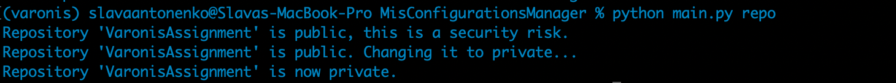
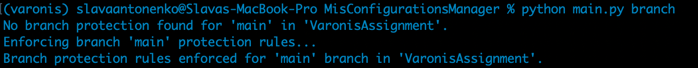

# MisConfigurationsManager

## Implemention

### Overview

This script demonstrates the risks associated with misconfiguring GitHub repository settings, specifically focusing on repository visibility and branch protection rules. By running this script, you would be able to see if these risks are already enforeced, if not the script enforced them automatically.

### Functionality
- Check if a repository is public and, if so, change it to private.
- Check if branch protection rules are set on a specified branch and, if not, apply default protection rules.

### Virtual env
It's better to use a virtual environment to run Python code. This way, you can avoid installing packages directly on your computer and manage multiple environments for different projects.
Most usefull tools are `conda` and `pyenv`

### Prerequisites

1. **Python**: Ensure you have Python installed on your system.
2. **PyGithub**: Install the PyGithub SDK using pip:
   ```pip install PyGithub```
3. Navigate to `MisConfigurationsManager` directory where the source code is located.
4. Update in `constants.py` the desired repo, branch and Github token.
5. **Setting Up the GitHub Token**

- 5a. Go to GitHub Settings

   - Navigate to [GitHub Settings](https://github.com/settings/tokens).
   - Click on the `Generate new token` button.
   - For this script, you need to select the following scopes:
     - `repo` (for private repository access)
     - `admin:repo_hook` (for branch protection)

- 5b. Update `constants.py`
   - Open the `constants.py` file in your project.
   - Replace the placeholder `your_personal_access_token` with the token you copied.
   - Save the changes to `constants.py`.
2. **Run**: ```python main.py```

#### Execution examples
Repo visibility


Branch protection rules


## Repository Visibility misconfiguration

**Meaning of this Configuration:**

Repository visibility determines who can see and access the code in a repository. Repositories can be either **public** or **private**:
- **Public Repositories**: Anyone on the internet can view and clone the repository.
- **Private Repositories**: Only people you explicitly grant access to can view or work with the repository.

**Best Practice:**

- **Private Repositories**: For projects that contain sensitive or proprietary information, it's a best practice to set the repository to private. This helps protect the code from unauthorized access.

**Steps to Fix the Configuration Manually:**

1. **Navigate to the Repository on GitHub**:
   - Go to the GitHub website and open the repository you want to change.
   
2. **Access the Settings**:
   - Click on the `Settings` tab located at the top of the repository page.

3. **Change Visibility**:
   - In the `Settings` menu, scroll down to the `Danger Zone` section.
   - Click on `Change repository visibility`.
   - Choose `Make private`, and follow the prompts to confirm.

**Workaround for Risks:**

- If you need to keep a repository public but want to limit access, consider using GitHub's `Code Scanning Alerts` and `Audit logs` to monitor all operations. However, this is not a substitute for setting the repository to private if confidentiality is a concern.

**Impact on Working with GitHub:**

Changing a repository from public to private restricts who can view or contribute to the code. This enhances security but requires you to manage and grant access to collaborators explicitly.</br>
So, if access restrictions wasn't configured properly before going private, it can prevent some of the users that weren't given access from being able to use the repo. </br>
Moreover, it can break automated pipelines that are using this repo. </br>

<b>NOTE: It's highly important to verify the repo access configuration before making the repo private</b>


# Misconfigurations Infrastructure

To build a robust framework for monitoring and fixing misconfigurations across various services, we need a structured and modular approach.

## a. The Framework

**Framework Overview:** The framework will be a comprehensive system designed to continuously monitor, detect, and remediate security misconfigurations across multiple services. It will support various types of services, including Infrastructure as a Service (IaaS), Software as a Service (SaaS), and Platform as a Service (PaaS). The framework will be modular, allowing easy integration of new services, configurations, and remediation strategies.

**Key Objectives:**
1. **Scalability:** The framework should be able to handle multiple environments and scale as the number of monitored services increases.
2. **Automation:** The framework should automate the detection and remediation of misconfigurations, reducing the need for manual intervention.
3. **Security:** Emphasizing secure practices, the framework will ensure that any changes made to configurations are logged and traceable.
4. **Observability:** Detection and remediations done by the framework will be easily monitored and viewed.

## b. Components of the System

### 1. Service Modules:

- **IaaS Module:** Manages and monitors security configurations related to infrastructure services like AWS, Azure, GCP.
- **SaaS Module:** Handles configurations for SaaS platforms like GitHub, Salesforce, Google Workspace.
- **PaaS Module:** Monitors platform services like AWS Elastic, OpenStack, and similar platforms.
- **Common Interface:** All modules will implement a common interface, defining methods for detecting, validating, remediating misconfigurations, and publishing metrics for reports and monitors.

### 2. Configuration Store:

- **Configuration Database:** A centralized database (e.g., SQL or NoSQL) that stores the current state of configurations across all monitored services. This database is essential for tracking changes over time and performing audits.
- **Configuration Templates:** Predefined templates outlining best practices for various configurations. These templates will be used for comparison against the current configuration state.
- **Detection Rules:** Predefined rules for validating configurations and detecting vulnerabilities, with remediation actions.

### 3. Detection Engine:

- **Scheduler:** A scheduler (e.g., Celery, Cron jobs) that triggers periodic checks on the configurations.
- **Detection Algorithms:** Custom algorithms that compare current configurations against best practices, identifying potential misconfigurations.
- **Remediation Scripts:** Python scripts (or other language scripts) that automate the process of fixing identified misconfigurations.
- **Manual Override:** An interface that allows security engineers to manually intervene and approve remediation actions before they are applied, or to discard remediations in specific cases.

### 4. Notification and Logging System:

- **Logging Service:** All actions, detections, and remediations will be logged for auditing and compliance purposes. This can be implemented using a logging framework like ELK Stack or AWS CloudWatch.
- **Metrics System:** All metrics for tracking reported, such as counts of detections and remediations, detected configurations’ source.
- **Notification System:** Alerts and notifications will be sent to relevant stakeholders via email, Slack, or other communication tools when misconfigurations are detected or remediated.
- **Pager Duty Integration:** PagerDuty alerts raised for detected vulnerable configurations without remediation.

### 5. Dashboard and Reporting:

- **Web Dashboard:** A visual dashboard (like Grafana) overview of the current security posture across all services. It will display detected misconfigurations, remediation actions, and overall system health.
- **Reporting Engine:** Generates periodic reports that summarize the findings and actions taken by the framework.

## c. Mechanisms for Initiating and Monitoring the System

### 1. System Initialization:

- **Service Registration:** During initialization, the framework will register all the services and configurations it needs to monitor. This involves reading from configuration files or a service registry.
- **Baseline Configuration Check:** Upon initialization, the framework will perform a baseline check to assess the current state of all configurations against best practices.

### 2. Monitoring Mechanisms:

- **Continuous Monitoring:** The detection engine will continuously monitor configurations based on the schedule defined. It will run checks at regular intervals and upon specific triggers like configuration changes or deployment events.
- **Performance Monitoring:** The system’s performance will be monitored using metrics such as the time taken for detection and remediation, resource usage, and the number of misconfigurations detected and fixed.

### 3. Error Handling and Recovery:

- **Retry Mechanism:** In case of failures during detection or remediation, the framework will have a retry mechanism with exponential backoff.
- **Error Logging:** All errors will be logged and flagged for manual review.

## d. Code Structure and Usage

### Code Structure:

```plaintext
/framework
    /core
        __init__.py: Initializes the core module.
        scheduler.py: Contains the logic for scheduling checks.
        database.py: Manages the configuration database.
        logging.py: Handles logging across the framework.
        constants.py: Contains all static variables.
    /services
        /iaas
            aws.py: Implements the IaaS module for AWS.
            azure.py: Implements the IaaS module for Azure.
            gcp.py: Implements the IaaS module for GCP.
        /saas
            github.py: Implements the SaaS module for GitHub.
        /paas
            elastic.py: Implements the PaaS module for Elastic.
    /interfaces
        common_interface.py: Defines the common interface for all service modules.
/tests
    Unit tests for each module.
```

## e. Basic Code Structure and Mock Classes
This code structure provides a basic framework that you can extend to accommodate various cloud services and configurations. The mock classes illustrate how the framework components interact and provide a foundation for further development.

```python
class GitHubService:
    def __init__(self, token, repo_name, branch_name):
        self.github = Github(token)
        self.repo_name = repo_name
        self.branch_name = branch_name

    def get_repo(self):
        return self.github.get_repo(self.repo_name)

    def detect(self, security_risks):
        # execute code from task #1 

    def enforce(self, security_risks):
        # execute code from task #1 
```

```python
class AWSService:
    def __init__(self, credentials):
        # Initialize AWS service connection
        pass

    def detect(self, security_risks):
        # Implement AWS-specific detection
        pass

    def enforce(self, security_risks):
        # Implement AWS-specific enforcement
        pass
```

```python
class AzureService:
    def __init__(self, credentials):
        # Initialize Azure service connection
        pass

    def detect(self, security_risks):
        # Implement Azure-specific detection
        pass

    def enforce(self, security_risks):
        # Implement Azure-specific enforcement
        pass
```

```python
class GCPService:
    def __init__(self, credentials):
        # Initialize GCP service connection
        pass

    def detect(self, security_risks):
        # Implement GCP-specific detection
        pass

    def enforce(self, security_risks):
        # Implement GCP-specific enforcement
        pass
```

```python
class ElasticService:
    def __init__(self, credentials):
        # Initialize GCP service connection
        pass

    def detect(self, security_risks):
        # Implement GCP-specific detection
        pass

    def enforce(self, security_risks):
        # Implement GCP-specific enforcement
        pass
```